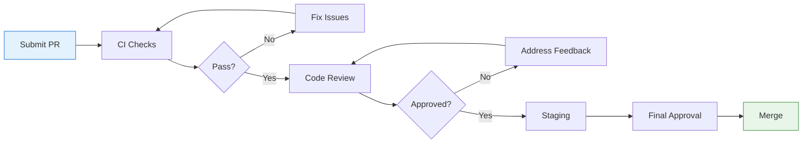

<div align="center">

# 🤝 Contributing to Ledgerline

**Thank you for your interest in improving Ledgerline!**


---

*We welcome improvements to simulation-first research workflows, accessibility, documentation, tests, and operator experience.*

</div>

---

## 📋 Table of Contents

- [Quick Start](#-quick-start)
- [Development Setup](#-development-setup)
- [Contribution Rules](#-contribution-rules)
- [What We're Looking For](#-what-were-looking-for)
- [What We're NOT Looking For](#-what-were-not-looking-for)
- [Pull Request Process](#-pull-request-process)
- [Code Style](#-code-style)
- [Testing](#-testing)
- [Documentation](#-documentation)
- [Community](#-community)

---

## 🚀 Quick Start

```bash
# 1. Fork the repository
# 2. Clone your fork
git clone https://github.com/YOUR_USERNAME/ai-investment-agent.git
cd ai-investment-agent

# 2. Install dependencies
pnpm install

# 3. Start development
pnpm dev

# 4. Create a feature branch
git checkout -b feat/my-feature

# 5. Make your changes and test
pnpm test
pnpm check
pnpm build

# 6. Commit and push
git commit -m "feat: add my feature"
git push origin feat/my-feature

# 7. Open a Pull Request
```

---

## 🛠️ Development Setup

### Prerequisites

| Requirement | Version | Purpose |
|-------------|---------|---------|
| **Node.js** | ≥ 24.x LTS | Runtime |
| **pnpm** | Latest | Package manager |
| **MySQL/TiDB** | 8.0+ | Database |

### Environment Setup

```bash
# Copy environment template
cp .env.example .env

# Edit with your local settings
# ⚠️ NEVER commit .env files
```

### Available Commands

| Command | Description |
|---------|-------------|
| `pnpm dev` | 🚀 Start development server |
| `pnpm test` | 🧪 Run test suite |
| `pnpm check` | 🔍 TypeScript type check |
| `pnpm build` | 📦 Production build |
| `pnpm format` | ✨ Format code with Prettier |

### Docker Setup (Alternative)

```bash
# Copy environment file
cp .env.example .env

# Start development environment
make dev

# Run tests in container
make test

# Type check in container
make typecheck
```

---

## 📜 Contribution Rules

<div align="center">

### 🚫 The Golden Rule

**Preserve the project's strict no-custody, no-credential, and no-live-execution boundaries.**

</div>

### ❌ Never Commit

| Category | Examples |
|----------|----------|
| **Secrets** | API keys, database URLs, JWT secrets, encryption keys |
| **Credentials** | Venue credentials, wallet keys, seed phrases, OAuth tokens |
| **Private Data** | Owner data, logs, personal information |
| **Generated Files** | Build output, node_modules, dist folders |
| **Misleading Data** | Fabricated balances, market data, trades, reviews |
| **Screenshots** | Unless following [demo dataset policy](docs/maintainers/demo-dataset-policy.md) |

### ✅ Always Do

| Task | Description |
|------|-------------|
| **Test Changes** | Add or update Vitest coverage for behavior changes |
| **Run Checks** | `pnpm test && pnpm check && pnpm build` before PR |
| **Follow Workflow** | `feat/*` or `fix/*` branches → PR → staging → approval |
| **Document Changes** | Update docs if behavior changes |
| **Preserve Accessibility** | Loading, empty, error, keyboard, dark-theme states |

---

## ✅ What We're Looking For

<div align="center">

### 🎯 High-Impact Contributions

</ Area>

| Category | Examples |
|----------|----------|
| 🧪 **Tests** | Unit tests, integration tests, edge case coverage |
| 📚 **Documentation** | Guides, tutorials, architecture explanations |
| ♿ **Accessibility** | Keyboard navigation, screen readers, reduced motion |
| 🎨 **UI/UX** | Better layouts, responsive design, dark theme |
| 🐛 **Bug Fixes** | Clear fixes with tests |
| ⚡ **Performance** | Optimizations with benchmarks |
| 🔒 **Security** | Vulnerability fixes, security reviews |

---

## 🚫 What We're NOT Looking For

<div align="center">

### ⛔ Contributions That Will Be Rejected

</div>

| Category | Why |
|----------|-----|
| ❌ **Real Trading Features** | Violates core security boundary |
| ❌ **Wallet/Custody Code** | No custody, signing, or withdrawal |
| ❌ **Fabricated Data** | Fake balances, trades, or performance |
| ❌ **Credential Handling** | No API keys, secrets, or tokens |
| ❌ **Bypassing Security** | No policy or isolation bypasses |
| ❌ **Unreviewed Dependencies** | Security risk |

---

## 📬 Pull Request Process

### Before Submitting

- [ ] Code follows project style
- [ ] Tests pass (`pnpm test`)
- [ ] Type check passes (`pnpm check`)
- [ ] Build succeeds (`pnpm build`)
- [ ] No secrets or credentials committed
- [ ] Documentation updated (if needed)

### PR Template

```markdown
## Description
Brief description of changes

## Type of Change
- [ ] Bug fix
- [ ] New feature
- [ ] Documentation
- [ ] Refactoring
- [ ] Other (describe)

## Testing
- [ ] Added/updated tests
- [ ] All tests pass
- [ ] Type check passes

## Security Impact
- [ ] No security impact
- [ ] Security impact (describe)

## Checklist
- [ ] No secrets committed
- [ ] Follows contribution rules
- [ ] Documentation updated
```

### Review Process



---

## 🎨 Code Style

### TypeScript

- Use TypeScript for all new code
- Prefer interfaces over types for object shapes
- Use `readonly` for immutable data
- Avoid `any` — use proper types

### React

- Functional components only
- Use hooks for state and effects
- Keep components small and focused
- Use TypeScript for props

### Styling

- Use Tailwind CSS utility classes
- Follow design tokens in `client/src/index.css`
- Support dark mode
- Use `prefers-reduced-motion` for animations

---

## 🧪 Testing

### Running Tests

```bash
# Run all tests
pnpm test

# Run specific test file
pnpm test server/security.test.ts

# Run tests in watch mode
pnpm test --watch
```

### Writing Tests

- Use Vitest
- Test behavior, not implementation
- Mock external dependencies
- Test edge cases and error states

---

## 📚 Documentation

### What to Document

- New features and APIs
- Configuration changes
- Breaking changes
- Security considerations

### Where to Document

- **Code comments** — Complex logic
- **README.md** — Project overview
- **docs/** — Guides and architecture
- **PR description** — Change context

---

## 👥 Community

### Getting Help

- 📖 [Documentation](docs/)
- 🐛 [Issue Tracker](https://github.com/FrancKINANI/ai-investment-agent/issues)
- 💬 [Discussions](https://github.com/FrancKINANI/ai-investment-agent/discussions)

### Reporting Issues

- Use GitHub Issues
- Include reproduction steps
- Include environment details
- Don't include secrets or credentials

---

## 📄 License

By contributing, you agree that your contributions will be licensed under the [MIT License](LICENSE).

---

<div align="center">

**Thank you for contributing to Ledgerline! 🎉**

[](https://github.com/FrancKINANI/ai-investment-agent)

</div>
