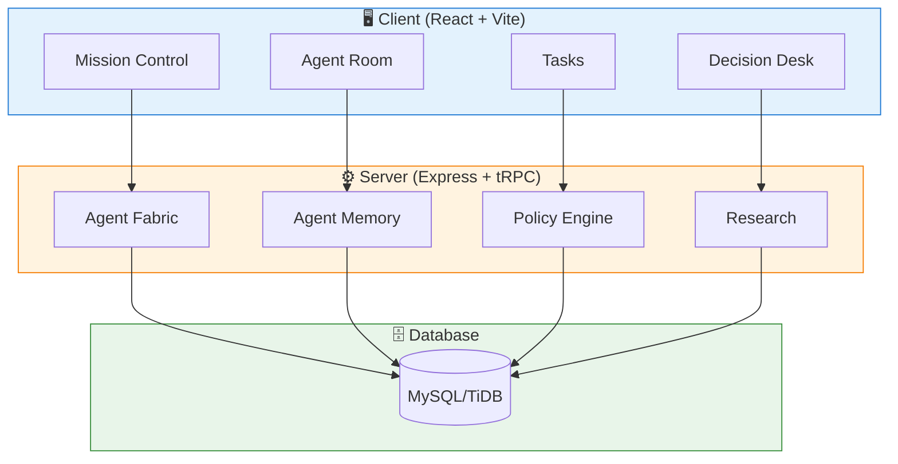
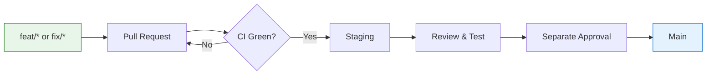

<div align="center">

# 🔐 Ledgerline

### A Private, Owner-Controlled Multi-Agent Investment Research Workspace


---

**Ledgerline** is an **AI investment operating system** for research, review, and simulation. It helps an owner operate a specialist research team, maintain visible evidence trails, and review paper decisions.

> *Observability grows before authority. The product explains what the team knows and why, without claiming it can move real capital.*

[](https://github.com/FrancKINANI/ai-investment-agent)
[](docs/architecture/current-architecture.md)
[](CONTRIBUTING.md)

</div>

---

## 🎯 What is Ledgerline?

Ledgerline is a **research-first investment workspace** that helps you:

| Capability | Description |
|------------|-------------|
| 🤖 **Operate Specialists** | Run a team of AI research agents with clear roles and boundaries |
| 📊 **Collect Evidence** | Gather public market data, on-chain evidence, and research findings |
| 📝 **Review Paper Proposals** | Evaluate investment decisions before any real execution |
| 🔍 **Maintain Audit Trails** | Keep immutable records of all research and decisions |
| 🔒 **Enforce Security** | Compile-time sealed boundaries prevent real capital movement |

---

## 🚀 Current Product State

The workspace provides a complete research environment:

| Workspace | Purpose | Status |
|-----------|---------|--------|
| **Mission Control** | Research desk, current work, tasks, decision attention | ✅ Active |
| **Agent Room** | Specialist conversations with inspectable context | ✅ Active |
| **Tasks** | Current, completed, and blocked agent work | ✅ Active |
| **Decision Desk** | Paper-proposal review and policy context | ✅ Active |
| **Portfolio** | Truthful account, connection, and policy posture | ✅ Active |
| **Activity** | Immutable owner-scoped activity and security signals | ✅ Active |
| **Configure** | Models, protected roles, specialists, policy | ✅ Active |

---

## 🔒 Security Boundary

<div align="center">

### 🚫 Real-Capital Status: **NO-GO**

</div>

| Capability | Status | Enforcement |
|------------|--------|-------------|
| Wallet Signing | 🚫 **Sealed** | Compile-time |
| On-Chain Action | 🚫 **Sealed** | Compile-time |
| Custody | 🚫 **Sealed** | Compile-time |
| Withdrawal | 🚫 **Sealed** | Compile-time |
| Binance Orders | 🚫 **Sealed** | Service boundary |
| MCP Activation | 🚫 **Sealed** | Manager rejects |

> **Important:** Creating configuration records, changing a feature flag, adding a key, or editing a mandate **cannot** lift the compiled execution seal. A separately authorised unsealing programme is required before any real-capital capability can be considered.

---

## ⚡ Quick Start

### Prerequisites

- **Node.js** ≥ 24.x LTS
- **pnpm** (package manager)
- **MySQL/TiDB** database

### Installation

```bash
# Clone the repository
git clone https://github.com/FrancKINANI/ai-investment-agent.git
cd ai-investment-agent

# Install dependencies
pnpm install --frozen-lockfile

# Start development server
pnpm dev
```

### Available Commands

| Command | Description |
|---------|-------------|
| `pnpm dev` | 🚀 Start development server |
| `pnpm test` | 🧪 Run test suite |
| `pnpm check` | 🔍 TypeScript type check |
| `pnpm build` | 📦 Production build |
| `pnpm audit --prod` | 🔒 Security audit |
| `pnpm drizzle-kit check` | 🗄️ Schema validation |

---

## 🧠 Memory System

Ledgerline treats memory as **visible owner data** rather than hidden chatbot history:

| Scope | Purpose | Visibility |
|-------|---------|------------|
| **Shared** | Team research context | Eligible research agents |
| **Private** | Specialist working notes | One agent + owner only |

### Promotion Workflow

```
Private Note → Owner Requests → Pending → Admin Review → Shared/Rejected
```

Memory is **always labelled as untrusted reference material** in model prompts.

---

## 🏗️ Architecture Overview



> 📖 **Full architecture details:** [docs/architecture/current-architecture.md](docs/architecture/current-architecture.md)

---

## 📚 Documentation

| Document | Audience | Description |
|----------|----------|-------------|
| [Getting Started](docs/guides/getting-started.md) | 🆕 New operators | Run workspace, first research loop |
| [Operator Guide](docs/guides/operator-guide.md) | 👩‍💼 Operators | Mission Control, Agent Room, tasks |
| [Architecture](docs/architecture/current-architecture.md) | 🏗️ Developers | System design, routes, services |
| [System Overview](docs/architecture/system-overview.md) | 👨‍💻 Developers | Data scopes, server enforcement |
| [Agent Memory](docs/architecture/agent-memory-workspace.md) | 🧠 Memory reviewers | Context construction, promotion |
| [Security](docs/architecture/security-and-data.md) | 🔐 Security reviewers | No-go controls, privacy |
| [Contributing](CONTRIBUTING.md) | 🤝 Contributors | Workflow, safety constraints |

---

## 🛠️ Technology Stack

<div align="center">

| Layer | Technologies |
|-------|--------------|
| **Frontend** | React 19 · Vite · tRPC · TanStack Query · Tailwind CSS · Radix UI |
| **Backend** | Express 5 · tRPC · Drizzle ORM · jose · Zod |
| **Database** | MySQL / TiDB |
| **Infrastructure** | Docker · Nginx · Prometheus · Grafana · GitHub Actions |

</div>

---

## 🔄 Development Workflow



---

## 🤝 Contributing

We welcome contributions! Please read our [Contributing Guide](CONTRIBUTING.md) before submitting a PR.

### Guidelines

- ✅ Use `feat/*` or `fix/*` branches
- ✅ All CI checks must pass before merge
- ✅ Follow the branch → PR → staging → approval → main workflow
- ❌ No fabricated balances, fills, or execution results
- ❌ No bypassing security controls

---

## 📄 License

This project is licensed under the **MIT License** — see [LICENSE](LICENSE) for details.

---

<div align="center">

**Built with ❤️ for research-first investing**

[](https://github.com/FrancKINANI/ai-investment-agent)
[](https://github.com/FrancKINANI/ai-investment-agent)

</div>
