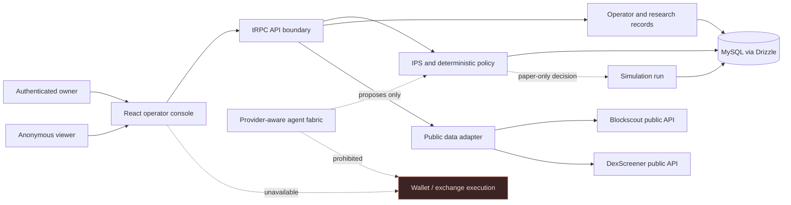

# Architecture

## System overview

Ledgerline uses a React control plane, an Express/tRPC API boundary, Drizzle ORM, and a MySQL-compatible database. All writes flow through authenticated procedures. Public token data is fetched server-side so the browser neither receives provider credentials nor directly invokes external data services.

## Application layers

| Layer | Technology | Responsibility |
| --- | --- | --- |
| Presentation | React, TypeScript, Tailwind/shadcn primitives | Responsive operator console and clear state boundaries. |
| Contract/API | Express, tRPC, Zod | Typed public/protected procedures and server-side validation. |
| Persistence | Drizzle, MySQL-compatible database | Owner IPS, actions, paper runs, awareness, lineage, evaluation, and outcome records. |
| External data | Server-side TypeScript adapter | Read-only Blockscout and DexScreener aggregation with source/freshness fields. |
| Agent fabric | Provider catalog and deterministic runtime logic | Role abstraction and policy-bound proposal evaluation. |

## Authoritative data model

| Record | Owner-scoped purpose | Key fields |
| --- | --- | --- |
| `investmentPolicies` | Versioned IPS constitution | Basis-point limits, approved contracts, simulation mode. |
| `operatorActions` | Immutable operator activity trail | Action kind, status, subject, detail, payload. |
| `agentRuns` | Paper simulation record | Policy result, status, evidence, simulation-only flag. |
| `awarenessRecords` | Four-layer operational explanation | Action, justification, result, or evolutionary layer. |
| `strategyLineages` | Strategy/thesis ancestry | Identifier, generation, stage, rationale, score map. |
| `strategyEvaluations` | Hard-gate review events | Gate result, coverage, complexity, rationale. |
| `outcomeRecords` | Expected versus realized paper observations | Expected/realized basis points, attribution, deviation. |

All business timestamps are UTC at the storage layer and are displayed in the viewer’s local time.

## API boundary

The main tRPC groups are deliberately small and owner-scoped.

| Router | Access | Examples |
| --- | --- | --- |
| `auth` | Public | Current user and logout. |
| `policy` | Protected | Read current IPS; save a new IPS version. |
| `history` | Protected | List actions, create explicit actions, start paper simulation. |
| `audit` | Protected | Create/list lineage, evaluation, outcome, and awareness data. |
| `agentRuntime` | Mixed | Provider catalog, profile/run views, deterministic proposal decision. |
| `onchain` | Public | Query an Ethereum ERC-20 contract using read-only upstream data. |

### Empty-state contract

An authenticated owner without an IPS receives **`null`**, not `undefined`, from `policy.current`. This is intentional: query layers require an explicit value, and `null` accurately expresses “no policy saved yet.”

## Agent fabric and authority model

The architecture maintains a provider-agnostic role model. Current models may be grouped by known provider family, but an agent’s output is always a proposal or analysis artifact. It is never a transaction request. The intended operating roles include macro/regime, on-chain/fundamentals, strategy variation, risk, evaluator, decision, and supervisor.

> **Execution invariant:** `execution.request` is not exposed in the MVP. A policy pass authorizes a paper artifact only.

## References

[1] [Blockscout API documentation](https://docs.blockscout.com/devs/apis)

[2] [DexScreener API reference](https://docs.dexscreener.com/api/reference)

[3] [NVIDIA, “NVIDIA AVO Reaches 100% on ARC-AGI-3”](https://developer.nvidia.com/blog/nvidia-avo-reaches-100-on-arc-agi-3-demonstrating-a-frontier-level-general-purpose-architecture-for-long-horizon-autonomous-agents/)
