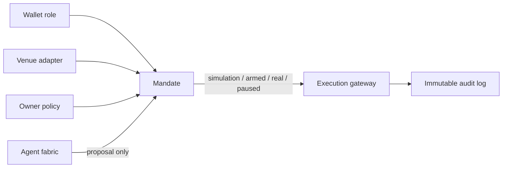

# Ledgerline Autonomous Operating System — Information Architecture

**Status:** Approved design specification for the next interface build.

## Navigation model

The application is organised around five persistent workspaces. The navigation deliberately separates **operating the agent** from **granting its authority** and **reviewing what it did**.

| Route | Workspace | Primary owner task | Real-mode authority |
| --- | --- | --- | --- |
| `/` | **Command Center** | Converse with the supervisor, watch agent tasks and evidence flow, review proposals, and observe mandate mode. | May display and pause a mandate; cannot enlarge authority. |
| `/wallets` | **Wallets & mandates** | Define trading, long-term, and future wallet roles; review balances, scope, caps, and mandate mode. | Owner may arm, pause, or change a named mandate. |
| `/connections` | **Venues** | Connect or disconnect exchange, on-chain, and prediction-market adapters; inspect required capabilities and connection state. | Owner only; every live credential is handled through a dedicated secret flow. |
| `/settings` | **Agent & policy configuration** | Select model routes, configure agent roles, set autonomy cadence, define IPS limits, and control the emergency stop. | Owner only for authority-expanding changes. |
| `/activity` | **Audit log** | Search the immutable timeline of evidence, proposals, mode changes, simulated fills, live acknowledgements, and reconciliations. | Read-only. |

## Command Center

The Command Center is the home screen. It is a live operational surface, not a static dashboard.

| Region | Behavior | Data state before connections exist |
| --- | --- | --- |
| Supervisor conversation | Owner asks for research, portfolio, or operating instructions; supervisor returns a structured plan and delegates tasks. | Works as a research/simulation conversation. |
| Agent fabric canvas | Shows the supervisor plus discovery, macro, on-chain, risk, portfolio, venue, execution, and audit agents as a directed work graph. | Shows each agent as ready, idle, or blocked—not as a fictitious live trade. |
| Mandate strip | Displays wallet-role mandates, venue, mode, policy status, pause state, and available authority. | Shows disconnected/simulation status until configured. |
| Proposal queue | Displays candidate actions after evidence and policy evaluation, with reason, confidence, risks, and lifecycle state. | Empty state or actual persisted simulated proposals only. |
| Evidence timeline | Shows source fetches, agent decisions, policy results, and order-status transitions. | Empty until a real user-triggered or scheduled run creates events. |

## Settings and configuration

Configuration is split by what it governs so that authority changes cannot be hidden in a generic settings screen.

| Settings tab | Owner controls | Agent controls within bounds |
| --- | --- | --- |
| Agent fabric | Provider/model route per role, reasoning budget, tool access, cadence, and whether a role may propose or veto. | Task prioritisation and model use only from the approved route list. |
| Policy | Universe, concentration, reserve, per-order, daily, drawdown, and venue constraints. | No changes that widen any limit. |
| Autonomy | Per-mandate mode, start/stop cadence, proposal threshold, automatic risk reduction, and escalation rules. | May pause or reduce risk; cannot arm real mode. |
| Emergency controls | Global pause, venue pause, revoke readiness, and last-resort cancellation policy. | May invoke the configured safety pause; cannot disable it. |

## Wallet and mandate model

A wallet record is an identity and role, not a storage location for a private key. A mandate is the only object that gives a configured venue adapter permission to simulate or, in a future armed state, perform bounded activity.

## Event model

Every meaningful operation emits an append-only event. A user-facing activity line is always backed by one of the following event classes:

| Class | Examples |
| --- | --- |
| `evidence` | Source fetch, source stale, data conflict, wallet reconciliation. |
| `agent` | Delegation, research completion, risk veto, supervisor escalation. |
| `policy` | Policy evaluation, mandate limit breach, mode switch, emergency pause. |
| `proposal` | Candidate creation, owner review, simulation start, simulated fill. |
| `execution` | Armed preview, venue acknowledgement, order state, cancellation, settlement, reconciliation. |
| `configuration` | Wallet role update, venue connection change, model route update, permission change. |

## Visual language

The new UI uses a **dark operations canvas** with an active agent network at the center, a compact left rail for routes, and an inspectable right-hand context panel. Green denotes a simulation-safe path, amber denotes review or armed state, and red denotes pause, block, or reconciliation failure. Real mode must remain visually distinct through an explicit red/amber authority badge rather than a cosmetic toggle.

The interface must not show fake portfolio balances, fake fills, or fake live connections. Any example/simulation state must be named **simulation** at the point of display and traceable to an event record.
