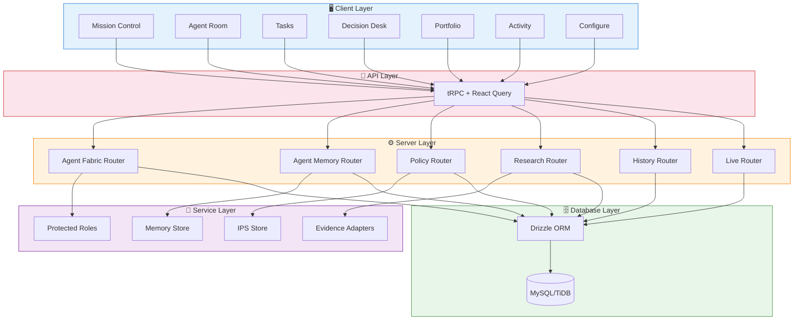
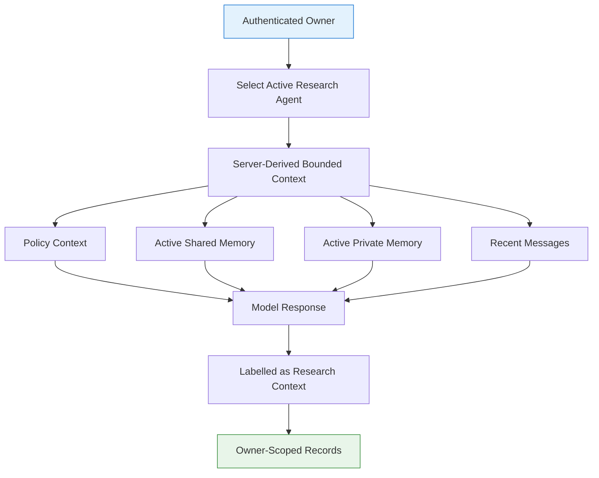
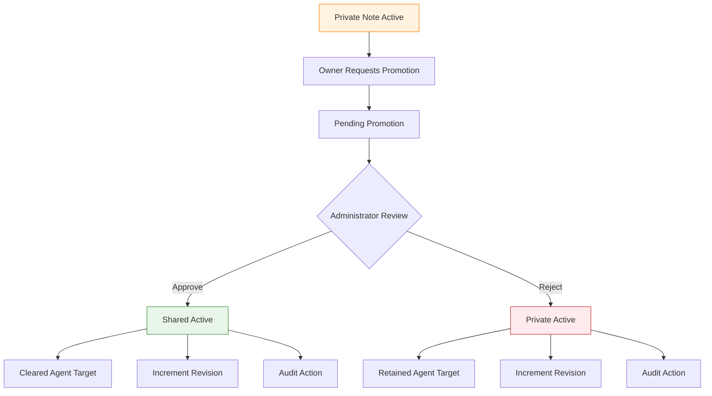
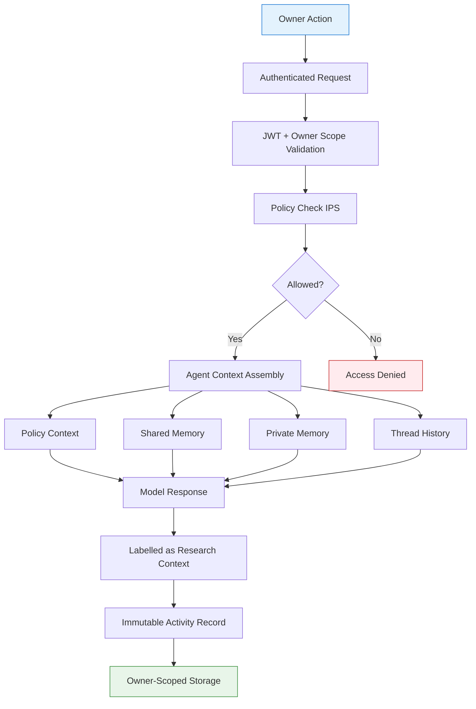
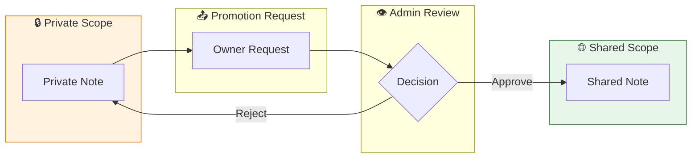
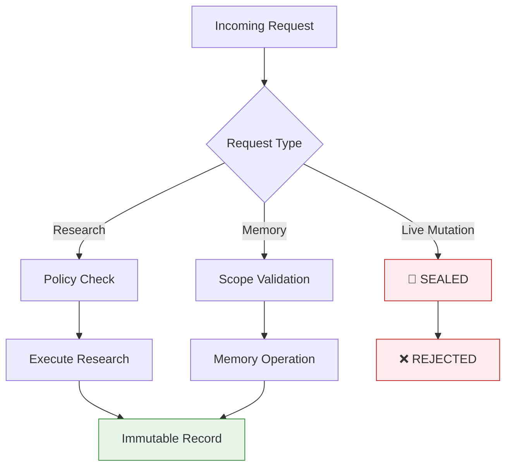
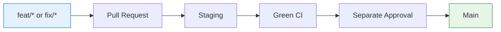

<div align="center">

# 🏗️ Ledgerline Architecture

**A private, owner-controlled multi-agent investment research workspace**


---

*Observability grows before authority. The product explains what the team knows and why, without claiming it can move real capital.*

</div>

## 🎯 Overview

Ledgerline is an **AI investment operating system** for research, review, and simulation. It helps an owner operate a specialist research team, maintain visible evidence trails, and review paper decisions.

| Aspect | Status |
|--------|--------|
| **Real Capital** | 🚫 **NO-GO** — Compile-time sealed |
| **Research & Simulation** | ✅ Active |
| **Agent Memory** | ✅ Active (shared + private scopes) |
| **Live Venue Mutation** | 🔒 Sealed (`LIVE_VENUE_MUTATIONS_SEALED = true`) |

---

## 🏠 Application Routes

| Route | Purpose | Description |
|-------|---------|-------------|
| `/` | **Mission Control** | Research desk, current work, tasks, decision attention, policy/account posture, audit trace |
| `/chat` | **Agent Room** | Supervisor and specialist conversations with inspectable shared/private context |
| `/tasks` | **Tasks** | Current, completed, and blocked owner-scoped agent work |
| `/decisions` | **Decision Desk** | Paper-proposal review and policy context |
| `/portfolio` | **Portfolio** | Truthful account, connection, and policy posture |
| `/activity` | **Activity** | Immutable owner-scoped activity and security signals |
| `/settings` | **Configure** | Models, protected roles, specialists, policy, schedules, preferences |

---

## 🧩 System Architecture



---

## 🤖 Agent Architecture

### Protected TradingAgents Roles

Server-defined roles that cannot be removed from the interface:

| Role Type | Description | Memory Access |
|-----------|-------------|---------------|
| **Supervisor** | Coordinates specialist roles | Shared context |
| **Research Specialists** | Focused research conversations | Shared + Private |
| **Execution Roles** | ⚠️ **Excluded from conversations** | ❌ No access |

### Context Assembly Flow



---

## 💾 Memory System

### Scopes

| Scope | Intended Content | Visibility |
|-------|------------------|------------|
| **Shared** | Owner-approved constraints, verified facts, evidence references, team decisions | Eligible research agents for same owner |
| **Private** | Specialist working notes, focused questions, role-specific constraints | Selected specialist + owner only |

### Promotion Workflow



### Memory Tables

| Table | Purpose |
|-------|---------|
| `agentIndividualConversations` | Focused individual conversations |
| `agentMemoryEntries` | Shared and private memory entries |
| `agentMemoryActions` | Promotion and lifecycle audit trail |

---

## 🔒 Security Boundaries

### Compile-Time Sealed Boundary

```typescript
LIVE_VENUE_MUTATIONS_SEALED = true  // Cannot be lifted by config
```

### What's Sealed

| Capability | Status | Enforcement |
|------------|--------|-------------|
| Wallet Signing | 🚫 Sealed | Compile-time |
| On-Chain Action | 🚫 Sealed | Compile-time |
| Custody | 🚫 Sealed | Compile-time |
| Withdrawal | 🚫 Sealed | Compile-time |
| Binance Orders | 🚫 Sealed | Service boundary |
| MCP Activation | 🚫 Sealed | Manager rejects |

### Owner Scope

All data is owner-scoped:
- Conversations, tasks, activity, memory entries, memory actions
- Individual threads belong to both owner AND selected agent
- Private memory filtered to exact agent ID (no broadening)

### Secret Handling

- Memory screened for private-key blocks, mnemonics, credentials
- Model prompt explicitly denies authority to override policy
- Stored memory = **untrusted reference material**

---

## 🛠️ Technology Stack

### Frontend

| Technology | Purpose |
|------------|---------|
| **React 19** | UI framework |
| **Vite** | Build tool & dev server |
| **tRPC** | Type-safe API layer |
| **TanStack Query** | Server state management |
| **Tailwind CSS** | Styling |
| **Radix UI** | Accessible components |
| **Framer Motion** | Animations |
| **wouter** | Routing |

### Backend

| Technology | Purpose |
|------------|---------|
| **Express 5** | HTTP server |
| **tRPC** | Type-safe RPC |
| **Drizzle ORM** | Database access |
| **MySQL/TiDB** | Database |
| **jose** | JWT handling |
| **Zod** | Schema validation |

### Infrastructure

| Technology | Purpose |
|------------|---------|
| **Docker** | Containerization |
| **Nginx** | Reverse proxy |
| **Prometheus** | Metrics |
| **Grafana** | Dashboards |
| **GitHub Actions** | CI/CD |

---

## 📊 Data Flow

### Request Processing Flow



### Memory Promotion Flow



### Security Boundary Flow



---

## 🗄️ Database Schema

### Core Tables

| Table | Purpose | Scope |
|-------|---------|-------|
| `users` | Owner accounts | Owner |
| `agents` | TradingAgents roles | Owner |
| `conversations` | Agent conversations | Owner |
| `messages` | Conversation messages | Owner + Agent |
| `agentIndividualConversations` | Focused individual conversations | Owner + Agent |
| `agentMemoryEntries` | Shared and private memory | Owner + Scope |
| `agentMemoryActions` | Memory lifecycle audit | Owner |
| `policies` | Investment Policy Statements | Owner |
| `tasks` | Agent work items | Owner |
| `decisions` | Paper proposals | Owner |
| `activity` | Immutable activity trail | Owner |

### Migration Strategy

- Additive migrations only (no destructive changes)
- Target environment must be explicitly named
- No sample data creation as side effect
- Review through branch → PR → staging workflow

---

## 🔧 Development

### Quick Start

```bash
git clone https://github.com/FrancKINANI/ai-investment-agent.git
cd ai-investment-agent
pnpm install --frozen-lockfile
pnpm dev
```

### Commands

| Command | Purpose |
|---------|---------|
| `pnpm dev` | Start development server |
| `pnpm test` | Run test suite |
| `pnpm check` | TypeScript type check |
| `pnpm build` | Production build |
| `pnpm audit --prod` | Security audit |
| `pnpm drizzle-kit check` | Schema validation |

### Branch Workflow



---

## 📚 Documentation

| Document | Audience | Purpose |
|----------|----------|---------|
| [Getting Started](../guides/getting-started.md) | New operators | Run workspace, first research loop |
| [Operator Guide](../guides/operator-guide.md) | Operators | Mission Control, Agent Room, tasks |
| [System Overview](./system-overview.md) | Developers | Routes, services, data scopes |
| [Agent Memory](./agent-memory-workspace.md) | Memory reviewers | Context construction, promotion |
| [Security](./security-and-data.md) | Security reviewers | No-go controls, privacy |
| [Contributing](../../CONTRIBUTING.md) | Contributors | Workflow, safety constraints |

---

## 🚨 Important Notes

> **Real-capital status: NO-GO**
>
> Creating configuration records, changing a feature flag, adding a key, or editing a mandate **cannot** lift the compiled execution seal. A separately authorised unsealing programme is required before any real-capital capability can be considered.

> **Memory is untrusted reference material**
>
> Stored memory is labelled as untrusted in model prompts. It cannot override policy, invoke tools, reveal secrets, or create execution behaviour.

---

<div align="center">

**Built with ❤️ for research-first investing**

[](https://github.com/FrancKINANI/ai-investment-agent)
[](LICENSE)

</div>
