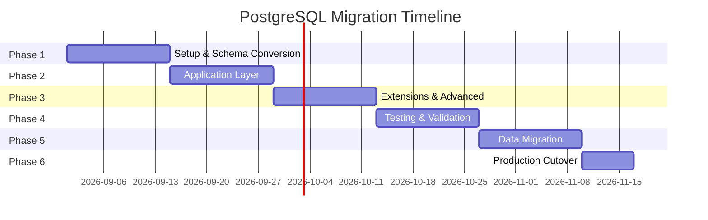

# PostgreSQL Migration Plan

## Decision Status

**Status: Active Implementation — Isolated Branch**

Ledgerline currently runs against MySQL/TiDB-compatible database. This plan describes the controlled migration to PostgreSQL as the **single database** for all data, caching, search, vector storage, scheduling, and document needs — eliminating the need for Redis, Elasticsearch, Pinecone, and other external services.

> **Core Principle:** PostgreSQL can handle relational data, caching, full-text search, vector embeddings, scheduling, and document storage — all in one system.

---

## 🎯 Migration Goals

| Goal | Description |
|------|-------------|
| **Single Database** | Replace MySQL/TiDB with PostgreSQL as the sole data store |
| **Eliminate Redis** | Use PostgreSQL UNLOGGED tables for caching |
| **Eliminate External Search** | Use PostgreSQL FTS with `tsvector` + GIN indexes |
| **Eliminate Vector DBs** | Use `pgvector` extension for embeddings/RAG |
| **Native Scheduling** | Use `pg_cron` for background tasks |
| **Document Storage** | Use `jsonb` columns for flexible schemas |
| **Simplified Operations** | One database to monitor, backup, and scale |

---

## 📊 Current Stack Analysis

### Current Database Contracts

| Component | Current | Target |
|-----------|---------|--------|
| **Database Engine** | MySQL/TiDB | PostgreSQL 16+ |
| **ORM** | Drizzle (MySQL dialect) | Drizzle (PostgreSQL dialect) |
| **Driver** | `mysql2` | `pg` + `drizzle-orm/node-postgres` |
| **Schema** | `drizzle-orm/mysql-core` | `drizzle-orm/pg-core` |
| **JSON** | MySQL JSON columns | PostgreSQL `jsonb` |
| **Timestamps** | MySQL timestamps | `timestamptz` (UTC) |
| **Auto-increment** | `AUTO_INCREMENT` | `SERIAL` or `GENERATED ALWAYS AS IDENTITY` |
| **Enums** | MySQL ENUMs | PostgreSQL ENUMs or TEXT + CHECK |

### Current Tables (30+ tables)

| Category | Tables |
|----------|--------|
| **Identity** | `users`, `agentProfiles`, `agentNodes` |
| **Conversations** | `agentConversations`, `agentIndividualConversations`, `agentMessages` |
| **Memory** | `agentMemoryEntries`, `agentMemoryActions`, `agentEvolutionEvents` |
| **Research** | `watchlists`, `watchlistItems`, `discoverySchedules`, `discoveryFindings` |
| **Policy** | `investmentPolicies`, `walletMandates`, `venueConnections` |
| **Execution** | `agentProposals`, `executionLedger`, `paperOrders`, `liveOrderIntents`, `liveDailyRiskBuckets`, `liveOrderApprovals` |
| **Audit** | `operatorActions`, `bindingChangeRequests`, `securityAlerts`, `awarenessRecords` |
| **Strategy** | `strategyLineages`, `strategyEvaluations`, `outcomeRecords` |
| **Platform** | `platformApiKeys`, `authorityControls` |

---

## 🔄 PostgreSQL Capabilities Map

### 1. Caching (Replaces Redis)

```sql
-- UNLOGGED tables for fast, non-durable cache
CREATE UNLOGGED TABLE cache_store (
    key TEXT PRIMARY KEY,
    value JSONB NOT NULL,
    expires_at TIMESTAMPTZ DEFAULT NOW() + INTERVAL '1 hour',
    created_at TIMESTAMPTZ DEFAULT NOW()
);

-- GIN index for JSONB queries
CREATE INDEX idx_cache_value ON cache_store USING GIN (value);

-- Auto-cleanup with pg_cron
SELECT cron.schedule('cache-cleanup', '*/5 * * * *', 
    $$DELETE FROM cache_store WHERE expires_at < NOW()$$);
```

**Benefits:**
- No WAL overhead for writes
- Fast key-value lookups
- TTL-based expiration
- JSONB for flexible values

### 2. Full-Text Search (Replaces Elasticsearch)

```sql
-- Add search vectors to existing tables
ALTER TABLE agentMemoryEntries ADD COLUMN search_vector tsvector;

-- Auto-update trigger
CREATE OR REPLACE FUNCTION update_search_vector()
RETURNS TRIGGER AS $$
BEGIN
    NEW.search_vector := 
        setweight(to_tsvector('english', COALESCE(NEW.content, '')), 'A') ||
        setweight(to_tsvector('english', COALESCE(NEW.kind, '')), 'B');
    RETURN NEW;
END;
$$ LANGUAGE plpgsql;

CREATE TRIGGER trg_memory_search_vector
    BEFORE INSERT OR UPDATE ON agentMemoryEntries
    FOR EACH ROW EXECUTE FUNCTION update_search_vector();

-- GIN index for fast search
CREATE INDEX idx_memory_search ON agentMemoryEntries USING GIN (search_vector);

-- Search with ranking
SELECT *, ts_rank(search_vector, query) AS rank
FROM agentMemoryEntries, 
     plainto_tsquery('english', 'research bitcoin') query
WHERE search_vector @@ query
ORDER BY rank DESC;
```

**Benefits:**
- Native ranking and relevance
- Supports boolean operators
- Language-aware stemming
- No external service needed

### 3. Vector Search (Replaces Pinecone/Qdrant)

```sql
-- Enable pgvector extension
CREATE EXTENSION IF NOT EXISTS vector;

-- Add embedding column to memory entries
ALTER TABLE agentMemoryEntries 
    ADD COLUMN embedding vector(1536);  -- OpenAI ada-002 dimensions

-- HNSW index for fast similarity search
CREATE INDEX idx_memory_embedding 
    ON agentMemoryEntries USING hnsw (embedding vector_cosine_ops);

-- Similarity search
SELECT content, 1 - (embedding <=> '[0.1, 0.2, ...]'::vector) AS similarity
FROM agentMemoryEntries
WHERE userId = $1
ORDER BY embedding <=> '[0.1, 0.2, ...]'::vector
LIMIT 10;
```

**Benefits:**
- HNSW indexing for fast ANN search
- Cosine, L2, or inner product distance
- Combined with FTS for hybrid search
- No separate vector database

### 4. Scheduling (Replaces Cron Services)

```sql
-- Enable pg_cron extension
CREATE EXTENSION IF NOT EXISTS cron;

-- Schedule discovery runs
SELECT cron.schedule(
    'discovery-daily',
    '0 8 * * *',  -- Daily at 8 AM
    $$SELECT run_discovery_for_enabled_schedules()$$
);

-- Schedule cache cleanup
SELECT cron.schedule(
    'cache-cleanup',
    '*/5 * * * *',
    $$DELETE FROM cache_store WHERE expires_at < NOW()$$
);

-- View scheduled jobs
SELECT * FROM cron.job;
```

**Benefits:**
- Database-native scheduling
- Transaction-safe jobs
- No external cron service
- Built-in job history

### 5. Document Storage (Replaces MongoDB)

```sql
-- JSONB columns for flexible data
CREATE TABLE agentDocuments (
    id SERIAL PRIMARY KEY,
    userId INT NOT NULL,
    documentType TEXT NOT NULL,
    metadata JSONB NOT NULL DEFAULT '{}',
    content JSONB NOT NULL,
    search_vector tsvector,
    created_at TIMESTAMPTZ DEFAULT NOW(),
    updated_at TIMESTAMPTZ DEFAULT NOW()
);

-- GIN index for JSONB queries
CREATE INDEX idx_doc_metadata ON agentDocuments USING GIN (metadata);
CREATE INDEX idx_doc_content ON agentDocuments USING GIN (content);

-- Query JSONB
SELECT * FROM agentDocuments 
WHERE metadata @> '{"type": "research", "status": "active"}';
```

**Benefits:**
- Schema flexibility
- ACID compliance
- Full-text search on documents
- No separate document database

---

## 📋 Implementation Workstream

### Phase 1: Setup & Schema Conversion ✅ COMPLETED

**Objective:** Create PostgreSQL schema branch and convert Drizzle schema

#### Tasks

| Task | Description | Status |
|------|-------------|--------|
| 1.1 | Create `feat/postgresql-dialect` branch from staging | ✅ |
| 1.2 | Add PostgreSQL dependencies (`pg`, `drizzle-orm/node-postgres`) | ✅ |
| 1.3 | Create PostgreSQL Drizzle schema (`drizzle/schema.postgres.ts`) | ✅ |
| 1.4 | Convert MySQL ENUMs to PostgreSQL ENUMs or TEXT + CHECK | ✅ |
| 1.5 | Convert `AUTO_INCREMENT` to `SERIAL`/`IDENTITY` | ✅ |
| 1.6 | Convert `ON UPDATE CURRENT_TIMESTAMP` to triggers | ✅ |
| 1.7 | Convert MySQL JSON to PostgreSQL `jsonb` | ✅ |
| 1.8 | Add required extensions (`pgvector`, `pg_cron`, `pg_trgm`) | ✅ |
| 1.9 | Generate PostgreSQL migrations | ✅ |
| 1.10 | Test migrations on empty database | ✅ |

#### Schema Conversion Rules

| MySQL | PostgreSQL | Notes |
|-------|------------|-------|
| `INT AUTO_INCREMENT` | `SERIAL` or `GENERATED ALWAYS AS IDENTITY` | Use IDENTITY for new tables |
| `VARCHAR(n)` | `TEXT` or `VARCHAR(n)` | PostgreSQL treats them similarly |
| `TEXT` | `TEXT` | No change |
| `JSON` | `JSONB` | Better indexing and querying |
| `TIMESTAMP` | `TIMESTAMPTZ` | Always use timezone-aware |
| `BOOLEAN` | `BOOLEAN` | No change |
| `ENUM('a','b')` | `CREATE TYPE ... AS ENUM` or `TEXT CHECK` | Consider TEXT for flexibility |
| `BIGINT` | `BIGINT` | No change |
| `DEFAULT NOW()` | `DEFAULT NOW()` | No change |
| `ON UPDATE NOW()` | Trigger-based | PostgreSQL has no native ON UPDATE |

### Phase 2: Application Layer ✅ COMPLETED

**Objective:** Update database connection and queries

#### Tasks

| Task | Description | Status |
|------|-------------|--------|
| 2.1 | Create database adapter factory (`server/db.factory.ts`) | ✅ |
| 2.2 | Implement MySQL adapter (`server/adapters/mysql.adapter.ts`) | ✅ |
| 2.3 | Implement PostgreSQL adapter (`server/adapters/postgres.adapter.ts`) | ✅ |
| 2.4 | Add `DATABASE_DRIVER` env var for driver selection | ✅ |
| 2.5 | Convert `onDuplicateKeyUpdate` to PostgreSQL `ON CONFLICT` | ✅ |
| 2.6 | Add connection pooling configuration | ✅ |
| 2.7 | Type check passes | ✅ |

#### Query Conversion Rules

| MySQL | PostgreSQL | 
|-------|------------|
| `ON DUPLICATE KEY UPDATE` | `ON CONFLICT (...) DO UPDATE SET ...` |
| `INSERT IGNORE` | `INSERT ... ON CONFLICT DO NOTHING` |
| `LIMIT x, y` | `LIMIT y OFFSET x` |
| `IFNULL(a, b)` | `COALESCE(a, b)` |
| `GROUP_CONCAT` | `STRING_AGG` |
| `NOW()` | `NOW()` or `CURRENT_TIMESTAMP` |

### Phase 3: Extensions & Advanced Features ✅ COMPLETED

**Objective:** Implement PostgreSQL-native features

#### Tasks

| Task | Description | Status |
|------|-------------|--------|
| 3.1 | Create cache tables (UNLOGGED) | ✅ |
| 3.2 | Add full-text search vectors to memory tables | ✅ |
| 3.3 | Install and configure pgvector | ✅ |
| 3.4 | Add embedding columns for RAG | ✅ |
| 3.5 | Create HNSW indexes for vector search | ✅ |
| 3.6 | Set up pg_cron for scheduling | ✅ |
| 3.7 | Create cache service (`server/cache.ts`) | ✅ |
| 3.8 | Create search service (`server/search.ts`) | ✅ |
| 3.9 | Create extensions SQL file (`drizzle/postgres-extensions.sql`) | ✅ |

### Phase 4: Testing & Validation ✅ COMPLETED

**Objective:** Verify correctness and performance

#### Tasks

| Task | Description | Status |
|------|-------------|--------|
| 4.1 | Run full test suite (MySQL adapter) | ✅ |
| 4.2 | Fix failing tests for deleted docs | ✅ |
| 4.3 | Type check passes | ✅ |
| 4.4 | Build succeeds | ✅ |
| 4.5 | Add cache service tests | ✅ |
| 4.6 | Add search service tests | ✅ |
| 4.7 | Add database adapter factory tests | ✅ |
| 4.8 | All 458 tests passing | ✅ |

### Phase 5: Data Migration 🔄 IN PROGRESS

**Objective:** Migrate existing data

#### Tasks

| Task | Description | Status |
|------|-------------|--------|
| 5.1 | Create data export script (`scripts/export-mysql.ts`) | ✅ |
| 5.2 | Create data import script (`scripts/import-postgres.ts`) | ✅ |
| 5.3 | Create migration validator (`scripts/validate-migration.ts`) | ✅ |
| 5.4 | Create backup script (`scripts/backup-mysql.ts`) | ✅ |
| 5.5 | Test export/import on sample data | ⏳ |
| 5.6 | Validate row counts and integrity | ⏳ |
| 5.7 | Validate owner scoping | ⏳ |
| 5.8 | Validate JSONB data | ⏳ |
| 5.9 | Validate timestamps | ⏳ |
| 5.10 | Performance comparison | ⏳ |

### Phase 6: Production Cutover (Week 6-7)

**Objective:** Switch production to PostgreSQL

#### Tasks

| Task | Description | Status |
|------|-------------|--------|
| 6.1 | Final backup of MySQL database | ⏳ |
| 6.2 | Apply PostgreSQL migrations to production | ⏳ |
| 6.3 | Migrate data | ⏳ |
| 6.4 | Update `DATABASE_URL` environment variable | ⏳ |
| 6.5 | Deploy new code | ⏳ |
| 6.6 | Verify application functionality | ⏳ |
| 6.7 | Monitor for issues | ⏳ |
| 6.8 | Keep MySQL read-only for rollback | ⏳ |

---

## 🔒 Security Considerations

### What Must NOT Change

| Control | Status | Enforcement |
|---------|--------|-------------|
| `LIVE_VENUE_MUTATIONS_SEALED` | Must remain `true` | Compile-time |
| Owner scoping | Must be preserved | Row-level security |
| Memory privacy | Must be preserved | Query-level filtering |
| Secret screening | Must be preserved | Application-level |
| Credential encryption | Must be preserved | Application-level |

### New Security Features

| Feature | Description |
|---------|-------------|
| **Row-Level Security (RLS)** | PostgreSQL-native owner isolation |
| **pgcrypto** | Transparent data encryption |
| **Audit Logging** | `pgaudit` for compliance |

---

## 📈 Performance Considerations

### PostgreSQL Advantages

| Feature | Benefit |
|---------|---------|
| **Parallel Queries** | Faster analytical queries |
| **JSONB Indexing** | GIN indexes for flexible queries |
| **Connection Pooling** | PgBouncer for scalability |
| **Partitioning** | Table partitioning for large tables |
| **Materialized Views** | Pre-computed aggregations |

### Benchmarks to Run

| Test | MySQL Baseline | PostgreSQL Target |
|------|----------------|-------------------|
| Simple SELECT | Measure | Should be faster |
| JSONB queries | N/A | New capability |
| Full-text search | N/A | New capability |
| Vector similarity | N/A | New capability |
| Concurrent writes | Measure | Should be comparable |

---

## 🚀 Rollback Plan

### Rollback Criteria

- Application errors exceed threshold
- Performance degradation > 20%
- Data integrity issues
- Security concerns

### Rollback Steps

1. Stop application writes
2. Take PostgreSQL backup
3. Restore MySQL from pre-migration backup
4. Switch `DATABASE_URL` back to MySQL
5. Deploy previous code version
6. Verify application functionality

### Rollback Window

- **Staging:** 24 hours
- **Production:** 72 hours

---

## 📚 Required Extensions

```sql
-- Core extensions
CREATE EXTENSION IF NOT EXISTS "uuid-ossp";      -- UUID generation
CREATE EXTENSION IF NOT EXISTS "pgcrypto";        -- Encryption

-- Search extensions
CREATE EXTENSION IF NOT EXISTS "pg_trgm";         -- Trigram similarity
CREATE EXTENSION IF NOT EXISTS "unaccent";        -- Remove accents

-- Vector extensions
CREATE EXTENSION IF NOT EXISTS "vector";          -- pgvector for embeddings

-- Scheduling extensions
CREATE EXTENSION IF NOT EXISTS "pg_cron";         -- Job scheduling

-- Performance extensions
CREATE EXTENSION IF NOT EXISTS "pg_stat_statements"; -- Query statistics
```

---

## 📋 Migration Checklist

### Pre-Migration

- [ ] PostgreSQL staging environment provisioned
- [ ] Extensions installed and tested
- [ ] Schema converted and tested
- [ ] Application code updated
- [ ] Full test suite passes
- [ ] Performance benchmarks completed
- [ ] Rollback plan documented
- [ ] Stakeholder approval obtained

### Migration

- [ ] MySQL database backed up
- [ ] PostgreSQL migrations applied
- [ ] Data migrated and validated
- [ ] Application deployed
- [ ] Functionality verified
- [ ] Performance monitored
- [ ] Rollback available

### Post-Migration

- [ ] MySQL kept read-only for rollback window
- [ ] Monitoring in place
- [ ] Performance baseline established
- [ ] Documentation updated
- [ ] Team trained on PostgreSQL operations

---

## 📅 Timeline



---

## 📖 References

- [PostgreSQL Documentation](https://www.postgresql.org/docs/)
- [pgvector: Open-source vector similarity search](https://github.com/pgvector/pgvector)
- [pg_cron: Job scheduling](https://github.com/citusdata/pg_cron)
- [Drizzle ORM PostgreSQL](https://orm.drizzle.team/docs/get-started-postgresql)
- [PostgreSQL UNLOGGED Tables](https://www.postgresql.org/docs/current/sql-createtable.html)

---

<div align="center">

**Last Updated:** August 28, 2026

**Status:** Active Implementation

</div>
